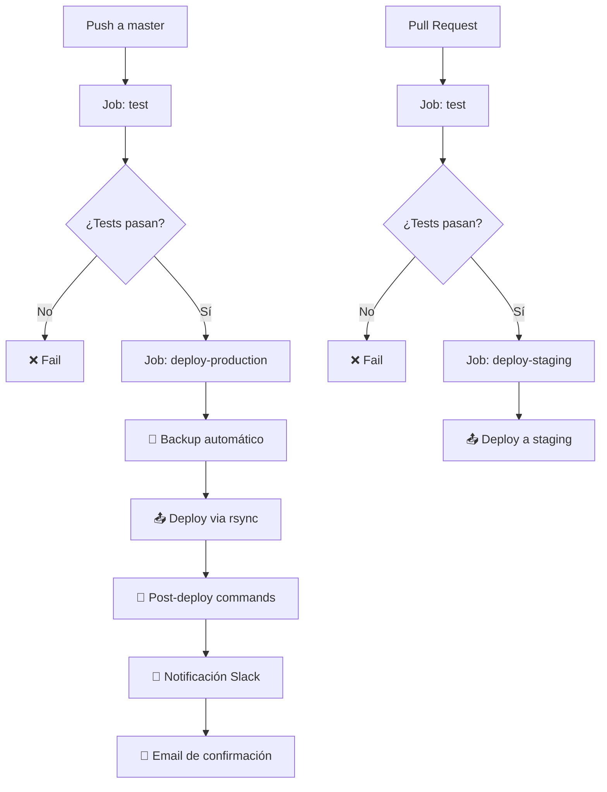

# 🏗️ Palafito B2B - WordPress WooCommerce

Un entorno personalizado de desarrollo para WordPress con WooCommerce, optimizado para comercio B2B (Business-to-Business).

## 📋 Descripción

Palafito B2B es una plataforma de comercio electrónico especializada en ventas mayoristas, construida sobre WordPress y WooCommerce con personalizaciones específicas para el mercado mexicano.

### ✨ Características principales

- **Precios B2B**: Sistema de precios diferenciados para clientes mayoristas
- **Descuentos por cantidad**: Aplicación automática de descuentos según volumen
- **Facturación mexicana**: Campos RFC y Uso CFDI integrados
- **Checkout personalizado**: Experiencia optimizada para B2B
- **Gestión de pedidos**: Flujos de trabajo especializados para mayoristas
- **Responsive design**: Optimizado para todos los dispositivos

## 🏗️ Estructura del proyecto

```
Palafito-b2b/
├── .github/                    # GitHub Actions para CI/CD
├── wp-content/
│   ├── plugins/
│   │   └── palafito-wc-extensions/  # Plugin personalizado
│   │       ├── includes/            # Clases y funcionalidades
│   │       ├── assets/              # CSS, JS y recursos
│   │       └── languages/           # Traducciones
│   └── themes/
│       └── palafito-child/          # Tema hijo de Kadence
│           ├── woocommerce/         # Templates personalizados
│           ├── js/                  # JavaScript del tema
│           └── images/              # Imágenes del tema
├── composer.json              # Dependencias PHP
├── phpcs.xml                  # Configuración de estándares
└── .gitignore                 # Archivos ignorados por Git
```

## 🚀 Configuración inicial

### Requisitos del sistema

- **PHP**: 7.4 o superior
- **WordPress**: 5.8 o superior
- **WooCommerce**: 6.0 o superior
- **MySQL**: 5.7 o superior
- **Composer**: Para gestión de dependencias

### Instalación

1. **Clonar el repositorio**
   ```bash
   git clone https://github.com/wizarck/palafito-b2b.git
   cd palafito-b2b
   ```

2. **Instalar dependencias PHP**
   ```bash
   composer install
   ```

3. **Configurar WordPress**
   - Copiar `wp-config-sample.php` a `wp-config.php`
   - Configurar base de datos y credenciales
   - Definir constantes de desarrollo

4. **Activar componentes**
   - Activar el tema hijo `palafito-child`
   - Activar el plugin `palafito-wc-extensions`
   - Configurar WooCommerce

5. **Configurar WooCommerce**
   - Moneda: MXN (Peso Mexicano)
   - País: México
   - Configurar métodos de pago y envío

## 🛠️ Desarrollo

### Scripts disponibles

```bash
# Linting del código
composer lint                    # Solo plugin personalizado
composer lint:all               # Todo wp-content

# Corrección automática
composer fix                    # Solo plugin personalizado
composer fix:all               # Todo wp-content
```

### Estándares de código

El proyecto utiliza **WordPress Coding Standards** con las siguientes configuraciones:

- **PHPCS**: WordPress-Extra + WordPress-Docs
- **PHP Version**: 7.4+
- **WordPress Version**: 5.8+
- **Exclusiones**: node_modules, vendor, cache

### Estructura del plugin

#### Clases principales

- `Palafito_WC_Extensions`: Clase principal del plugin
- `Palafito_Checkout_Customizations`: Personalizaciones del checkout
- `Palafito_B2B_Pricing`: Sistema de precios B2B

#### Hooks implementados

```php
// Checkout
woocommerce_checkout_fields
woocommerce_before_checkout_form
woocommerce_checkout_update_order_meta

// Precios
woocommerce_product_get_price
woocommerce_before_calculate_totals

// Productos
woocommerce_single_product_summary
woocommerce_after_shop_loop_item_title
```

### Estructura del tema hijo

#### Funcionalidades implementadas

- **Enqueue de assets**: CSS y JS optimizados
- **Personalizaciones WooCommerce**: Templates y hooks
- **Responsive design**: Adaptaciones móviles
- **Performance**: Lazy loading y optimizaciones

#### Archivos principales

- `functions.php`: Clase principal del tema
- `woocommerce.css`: Estilos específicos de WooCommerce
- `js/palafito-child.js`: JavaScript del tema

## 🎨 Personalizaciones B2B

### Sistema de precios

```php
// Precio B2B específico por producto
$b2b_price = get_post_meta($product_id, '_b2b_price', true);

// Descuentos por cantidad
$quantity_discounts = get_post_meta($product_id, '_quantity_discounts', true);
```

### Campos de facturación

- **RFC**: Validación automática de formato mexicano
- **Uso CFDI**: Catálogo completo de usos fiscales
- **Condiciones de pago**: Neto 30, Neto 60, etc.
- **Instrucciones de envío**: Campo personalizado

### Roles de usuario

```php
// Verificar si es usuario B2B
function is_b2b_user() {
    return in_array('b2b_customer', wp_get_current_user()->roles);
}
```

## 🔧 Configuración de producción

### Variables de entorno

```php
// wp-config.php
define('WP_DEBUG', false);
define('WP_CACHE', true);
define('FORCE_SSL_ADMIN', true);
define('WP_AUTO_UPDATE_CORE', true);
```

### Optimizaciones recomendadas

1. **Caché**
   - Redis o Memcached
   - WP Rocket o W3 Total Cache
   - CDN para assets estáticos

2. **Base de datos**
   - Optimización de consultas
   - Índices apropiados
   - Backup automático

3. **Seguridad**
   - HTTPS obligatorio
   - Firewall de aplicación
   - Escaneo de malware

## 📦 Deployment

### GitHub Actions CI/CD

El proyecto incluye un workflow automatizado completo para testing, staging y producción:

#### 🚀 Workflow: Deploy to Production

**Archivo**: `.github/workflows/deploy.yml`

**Triggers**:
- Push a rama `master`
- Pull Request a rama `master`

#### 📋 Jobs del Workflow

##### 1. **Job: test** (Testing y Linting)
- **Runs on**: `ubuntu-latest`
- **Funciones**:
  - ✅ Setup PHP 8.1 con extensiones necesarias
  - ✅ Validación de `composer.json`
  - ✅ Instalación de dependencias
  - ✅ Ejecución de PHPCS (WordPress Coding Standards)
  - ✅ Verificación de sintaxis PHP
  - ✅ Security audit con Composer

##### 2. **Job: deploy-staging** (Deployment a Staging)
- **Needs**: `test` (se ejecuta solo si test pasa)
- **Trigger**: Pull Request
- **Funciones**:
  - 🔐 Setup SSH con clave privada
  - 📤 Deploy via rsync (excluye archivos de desarrollo)
  - 🔧 Post-deploy commands:
    - `composer install --no-dev --optimize-autoloader`
    - `wp cache flush`
    - `wp rewrite flush`

##### 3. **Job: deploy-production** (Deployment a Producción)
- **Needs**: `test` (se ejecuta solo si test pasa)
- **Trigger**: Push a `master`
- **Environment**: `production` (requiere aprobación)
- **Funciones**:
  - 💾 Backup automático antes del deploy
  - 📤 Deploy via rsync con exclusiones
  - 🔧 Post-deploy commands:
    - `composer install --no-dev --optimize-autoloader`
    - `wp cache flush`
    - `wp rewrite flush`
    - `wp db optimize`
  - 📢 Notificación Slack automática

##### 4. **Job: notify** (Notificaciones)
- **Needs**: `deploy-production`
- **Trigger**: Push a `master`
- **Funciones**:
  - 📧 Email de confirmación de deployment
  - 📊 Detalles del commit y autor

#### 🔐 Secrets Requeridos

Para que el workflow funcione correctamente, necesitas configurar estos secrets en GitHub:

**Staging**:
- `STAGING_SSH_KEY`: Clave SSH privada para staging
- `STAGING_HOST`: Hostname del servidor staging
- `STAGING_USER`: Usuario SSH para staging
- `STAGING_PATH`: Ruta en el servidor staging

**Producción**:
- `PRODUCTION_SSH_KEY`: Clave SSH privada para producción
- `PRODUCTION_HOST`: Hostname del servidor producción
- `PRODUCTION_USER`: Usuario SSH para producción
- `PRODUCTION_PATH`: Ruta en el servidor producción
- `PRODUCTION_URL`: URL del sitio en producción

**Notificaciones**:
- `SLACK_WEBHOOK`: Webhook URL de Slack
- `SMTP_SERVER`: Servidor SMTP
- `SMTP_PORT`: Puerto SMTP
- `SMTP_USERNAME`: Usuario SMTP
- `SMTP_PASSWORD`: Contraseña SMTP
- `NOTIFICATION_EMAIL`: Email para notificaciones

#### 🔄 Flujo de Trabajo



#### 🛠️ Comandos de Deployment Manual

Si necesitas hacer deployment manual:

```bash
# Preparar para producción
composer install --no-dev --optimize-autoloader

# Verificar sintaxis PHP
find wp-content -name "*.php" -exec php -l {} \;

# Linting del código
composer lint:all

# Sincronizar con servidor (ejemplo)
rsync -avz --delete \
  --exclude='.git' \
  --exclude='node_modules' \
  --exclude='vendor' \
  --exclude='.github' \
  --exclude='README.md' \
  --exclude='composer.*' \
  --exclude='phpcs.xml' \
  ./ user@server:/path/to/wordpress/
```

#### 📊 Monitoreo

- **GitHub Actions**: Ve a la pestaña "Actions" en tu repositorio
- **Logs de deployment**: Disponibles en cada run del workflow
- **Notificaciones**: Slack y email automáticos
- **Rollback**: Usar backup automático si es necesario

### Proceso de deployment

1. **Desarrollo**: Rama `develop` (testing local)
2. **Staging**: Pull Request → Deploy automático a staging
3. **Producción**: Push a `master` → Deploy automático a producción

## 🧪 Testing

### Pruebas manuales

- [ ] Checkout completo con datos B2B
- [ ] Aplicación de precios B2B
- [ ] Descuentos por cantidad
- [ ] Validación de RFC
- [ ] Emails personalizados
- [ ] Responsive design

### Herramientas de testing

- **PHPUnit**: Para pruebas unitarias
- **Codeception**: Para pruebas de integración
- **BrowserStack**: Para testing cross-browser

## 📚 Documentación adicional

### Hooks personalizados

```php
// Aplicar descuento B2B personalizado
add_filter('palafito_b2b_discount_percentage', function($percentage) {
    return 15.0; // 15% de descuento
});

// Personalizar campos de checkout
add_filter('palafito_checkout_fields', function($fields) {
    // Modificar campos
    return $fields;
});
```

### Funciones auxiliares

```php
// Obtener información B2B del usuario
$b2b_info = palafito_get_b2b_user_info($user_id);

// Formatear precio B2B
$formatted_price = palafito_format_b2b_price($price, 'MXN');

// Verificar si es página de WooCommerce
if (palafito_is_woocommerce_page()) {
    // Lógica específica
}
```

## 🤝 Contribución

### Flujo de trabajo

1. **Fork** del repositorio
2. **Crear** rama feature (`git checkout -b feature/nueva-funcionalidad`)
3. **Commit** cambios (`git commit -am 'Agregar nueva funcionalidad'`)
4. **Push** a la rama (`git push origin feature/nueva-funcionalidad`)
5. **Crear** Pull Request a `master`

### Estándares de commit

```
feat: agregar sistema de precios B2B
fix: corregir validación de RFC
docs: actualizar documentación
style: mejorar estilos de checkout
refactor: reorganizar clases del plugin
test: agregar pruebas para precios B2B
```

## 📄 Licencia

Este proyecto es privado y propietario. Todos los derechos reservados.

## 👥 Equipo

- **Desarrollador**: Arturo Ramirez
- **Contacto**: [GitHub](https://github.com/wizarck)
- **Proyecto**: Palafito B2B

## 🔗 Enlaces útiles

- [WordPress Developer Handbook](https://developer.wordpress.org/)
- [WooCommerce Developer Docs](https://docs.woocommerce.com/)
- [WordPress Coding Standards](https://developer.wordpress.org/coding-standards/)
- [Composer Documentation](https://getcomposer.org/doc/)

---

**Palafito B2B** - Tu plataforma de confianza para comercio mayorista 🚀
