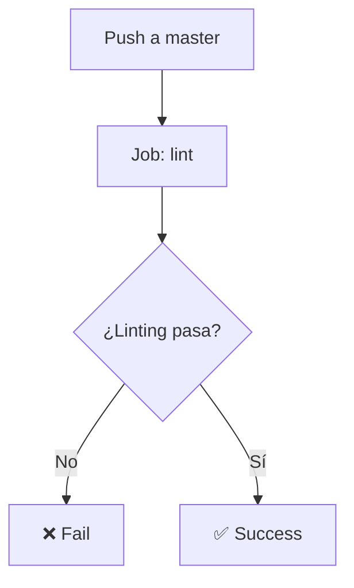

# 🏗️ Palafito B2B - WordPress WooCommerce

Un entorno personalizado de desarrollo para WordPress con WooCommerce, optimizado para comercio B2B (Business-to-Business).

## 📋 Descripción

Palafito B2B es una plataforma de comercio electrónico especializada en ventas mayoristas, construida sobre WordPress y WooCommerce con personalizaciones específicas para el mercado mexicano.

### ✨ Características principales

- **Checkout personalizado**: Campos "Last Name" opcionales en billing y shipping
- **Tema personalizado**: Child theme de Kadence con estilos B2B
- **Plugin custom**: Extensiones específicas para WooCommerce
- **CI/CD automatizado**: GitHub Actions para testing y deployment
- **Responsive design**: Optimizado para todos los dispositivos

## 🏗️ Estructura del proyecto

```
Palafito-b2b/
├── .github/                    # GitHub Actions para CI/CD
├── wp-content/
│   ├── plugins/
│   │   ├── wholesalex/         # Plugin B2B de precios (YA FUNCIONANDO)
│   │   └── palafito-wc-extensions/  # Plugin personalizado
│   │       ├── includes/            # Clases y funcionalidades
│   │       ├── assets/              # CSS, JS y recursos
│   │       └── languages/           # Traducciones
│   └── themes/
│       ├── kadence/            # Tema padre
│       └── palafito-child/     # Tema hijo personalizado
│           ├── woocommerce/         # Templates personalizados
│           ├── js/                  # JavaScript del tema
│           └── images/              # Imágenes del tema
├── composer.json              # Dependencias PHP
├── phpcs.xml                  # Configuración de estándares
├── CONTEXT.md                 # Memoria del proyecto
├── TODO.md                    # Lista de tareas generales
├── TODO-DESIGN-DIAGNOSIS.md   # Diagnóstico de problemas de diseño
└── .gitignore                 # Archivos ignorados por Git
```

## 🚀 Configuración inicial

### Requisitos del sistema

- **PHP**: 7.4 o superior (producción: 4.4.9)
- **WordPress**: 6.4+
- **WooCommerce**: 8.0+
- **MySQL**: 5.7 o superior
- **Composer**: Para gestión de dependencias

### Instalación

1. **Clonar el repositorio**
   ```bash
   git clone https://github.com/wizarck/palafito-b2b.git
   cd palafito-b2b
   ```

2. **Instalar dependencias PHP**
   ```bash
   composer install
   ```

3. **Configurar WordPress**
   - Copiar `wp-config-sample.php` a `wp-config.php`
   - Configurar base de datos y credenciales
   - Definir constantes de desarrollo

4. **Activar componentes**
   - Activar el tema hijo `palafito-child`
   - Activar el plugin `palafito-wc-extensions`
   - Activar el plugin `wholesalex` (B2B pricing)
   - Configurar WooCommerce

5. **Configurar WooCommerce**
   - Moneda: MXN (Peso Mexicano)
   - País: México
   - Configurar métodos de pago y envío

## 🛠️ Desarrollo

### Scripts disponibles

```bash
# Linting del código
composer lint                    # Solo plugin personalizado
composer lint:all               # Todo wp-content

# Corrección automática
composer fix                    # Solo plugin personalizado
composer fix:all               # Todo wp-content
```

### Estándares de código

El proyecto utiliza **WordPress Coding Standards** con las siguientes configuraciones:

- **PHPCS**: WordPress-Extra + WordPress-Docs
- **PHP Version**: 7.4+
- **WordPress Version**: 6.4+
- **Exclusiones**: node_modules, vendor, cache

### Estructura del plugin

#### Clase principal

- `Palafito_WC_Extensions`: Clase principal del plugin
- `Palafito_Checkout_Customizations`: Personalizaciones del checkout

#### Hooks implementados

```php
// Checkout
woocommerce_checkout_fields
woocommerce_before_checkout_form
woocommerce_checkout_update_order_meta

// Productos
woocommerce_single_product_summary
woocommerce_after_shop_loop_item_title
```

### Estructura del tema hijo

#### Funcionalidades implementadas

- **Enqueue de assets**: CSS y JS optimizados
- **Personalizaciones WooCommerce**: Templates y hooks
- **Responsive design**: Adaptaciones móviles
- **Performance**: Lazy loading y optimizaciones
- **HTTPS Fix**: Conversión automática de URLs HTTP a HTTPS
- **CSP Fix**: Manejo de Content Security Policy

#### Archivos principales

- `functions.php`: Clase principal del tema
- `style.css`: Estilos del tema hijo (mínimo)
- `woocommerce.css`: Estilos específicos de WooCommerce
- `js/palafito-child.js`: JavaScript del tema

## 🎨 Personalizaciones B2B

### Checkout personalizado

- **Campos "Last Name" opcionales**: Tanto en billing como shipping
- **Validación mejorada**: Campos requeridos optimizados para B2B
- **Experiencia de usuario**: Flujo simplificado para mayoristas

### Plugin WholesaleX

- **Precios B2B**: Sistema de precios diferenciados para mayoristas
- **Configuración**: Requiere configuración manual en admin
- **Estado**: YA FUNCIONANDO - NO TOCAR

### Dirección de tienda y cliente en PDFs

- La dirección del cliente en los documentos PDF (factura y albarán) sigue el formato:
  - [Nombre] [Apellido]
  - NIF: [NIF del cliente] (solo en facturación, si existe)
  - Dirección (calle, número, piso, puerta)
  - Código Postal Ciudad - País (nombre completo)
  - Teléfono: [Teléfono de contacto] (si existe)
- La dirección de la empresa (tienda) sigue el formato:
  - NIF: [NIF de la empresa]
  - Dirección (calle, número)
  - Código Postal Ciudad - País (nombre completo)
  - Email: [Email de contacto]
- El formato es limpio, sin repeticiones, y con los prefijos 'NIF:', 'Teléfono:' y 'Email:' donde corresponde. El nombre de la empresa no se repite en la dirección de tienda.

### Tabla de pedidos personalizada en Mi Cuenta

- **Columna "Nota de cliente"**: Añadida a la tabla de pedidos de la sección "Mi cuenta".
    - Muestra la nota de cliente (customer note) asociada al pedido.
    - Truncada a 25 caracteres, con puntos suspensivos si excede.
    - Tooltip nativo (title) con el texto completo al hacer hover.
    - Si no hay nota, la celda queda vacía.
    - No se fuerza ancho extra, solo truncado visual.

- **Columna de acciones más ancha**: La columna de acciones en la tabla de pedidos de Mi Cuenta tiene un ancho mínimo suficiente para que los botones de Factura y Albarán siempre se vean en la misma línea, sin saltos ni desbordes. Mejora la experiencia visual y la usabilidad.

**Ejemplo visual:**

| Pedido | Nota de cliente           | Fecha      | Estado    | Total   | Acciones |
|--------|---------------------------|------------|-----------|---------|----------|
| #1234  | "Por favor entregar..."   | 10/07/2025 | Procesando| $500 MXN| [Ver]    |
| #1235  |                           | 10/07/2025 | Entregado | $200 MXN| [Ver]    |
| #1236  | "Llamar antes de salir"   | 09/07/2025 | Facturado | $800 MXN| [Ver]    |

- Hover sobre la nota muestra el texto completo.
- Lógica y decisión documentadas en CONTEXT.md y TODO.md.

### Nota de cliente tras merge de pedidos

- **Nota de cliente tras merge de pedidos**: Cuando se realiza un merge, la nota de cliente del pedido resultante se reemplaza por la nota final generada (la misma que la nota de factura). Si existía una nota de cliente previa, se añade como postfijo, precedida por una línea en blanco y el texto:
  
  Nota original: [NOTA VIEJA]
  
  Si no había nota previa, solo se muestra la nota final generada. Las notas de cliente de los pedidos originales no se modifican.

**Ejemplo visual:**

```
Feria: C00262 - Feria X
Obrador: C00264
C00270

Nota original: Por favor entregar antes de las 12h.
```

### Fecha de entrega en albarán (packing slip)
- **Fecha de entrega en albarán (packing slip)**: La fecha de entrega que aparece en el PDF de albarán se obtiene del meta personalizado `_wcpdf_packing_slip_date`. Si no existe, se muestra la fecha actual (d/m/Y) y se guarda automáticamente en el meta para futuras visualizaciones. Así, la fecha de entrega siempre queda sincronizada entre el PDF y el metabox de edición de pedido.

## 🔧 Configuración de producción

### Variables de entorno

```php
// wp-config.php
define('WP_DEBUG', false);
define('WP_CACHE', true);
define('FORCE_SSL_ADMIN', true);
define('WP_AUTO_UPDATE_CORE', true);
```

### Optimizaciones recomendadas

1. **Caché**
   - Redis o Memcached
   - WP Rocket o W3 Total Cache
   - CDN para assets estáticos

2. **Base de datos**
   - Optimización de consultas
   - Índices apropiados
   - Backup automático

3. **Seguridad**
   - HTTPS obligatorio
   - Firewall de aplicación
   - Escaneo de malware

## 📦 Deployment

### GitHub Actions CI/CD

El proyecto incluye un workflow automatizado para testing y linting:

#### 🚀 Workflow: PHP Linting

**Archivo**: `.github/workflows/php-linting.yml`

**Triggers**:
- Push a rama `master`
- Pull Request a rama `master`

#### 📋 Jobs del Workflow

##### 1. **Job: lint** (PHP Linting y Coding Standards)
- **Runs on**: `ubuntu-latest`
- **Funciones**:
  - ✅ Setup PHP 8.1 con extensiones necesarias
  - ✅ Validación de `composer.json`
  - ✅ Instalación de dependencias
  - ✅ Ejecución de PHPCS (WordPress Coding Standards)
  - ✅ Verificación de sintaxis PHP
  - ✅ Security audit con Composer

#### 🔄 Flujo de Trabajo



### Proceso de deployment

1. **Desarrollo**: Rama `develop` (testing local)
2. **Testing**: Push a `master` → Linting automático
3. **Producción**: Deploy manual después de linting exitoso

## 🐛 Problemas Resueltos

### 1. Error Fatal `get_instance()`
- **Problema**: Plugin intentaba llamar método inexistente
- **Solución**: Removido patrón singleton, instanciación directa
- **Estado**: ✅ Resuelto

### 2. CSS Roto en Producción
- **Problema**: Diseño roto después de deployment
- **Causa**: Inicialización duplicada del plugin
- **Solución**: Movido inicialización al hook `init`, removida duplicación
- **Estado**: ✅ Resuelto

### 3. Mixed Content Warnings
- **Problema**: Console warnings sobre Mixed Content
- **Solución**: Script `fix-https-urls.php` ejecutado exitosamente
- **Estado**: ✅ Resuelto

### 4. Content Security Policy (CSP)
- **Problema**: CSP bloqueando CSS dinámico de Kadence
- **Solución**: Función `palafito_comprehensive_https_fix()` implementada
- **Estado**: ✅ Resuelto

## 🔄 Problemas Actuales

### Diseño y CSS
- **Fuentes**: No coinciden con Kadence
- **Botones**: Comportamiento extraño en hover
- **Diagnóstico**: TODO-DESIGN-DIAGNOSIS.md creado con 10 puntos de verificación

## 🧪 Testing

### Pruebas manuales

- [ ] Checkout completo con campos opcionales
- [ ] Plugin WholesaleX funcionando
- [ ] Tema hijo cargando correctamente
- [ ] HTTPS funcionando sin warnings
- [ ] Responsive design
- [ ] CSS sin errores de CSP

### Herramientas de testing

- **PHPCS**: Para estándares de código
- **Composer**: Para auditoría de seguridad
- **BrowserStack**: Para testing cross-browser

## 📚 Documentación adicional

### Hooks personalizados

```php
// Personalizar campos de checkout
add_filter('palafito_checkout_fields', function($fields) {
    // Modificar campos
    return $fields;
});
```

### Funciones auxiliares

```php
// Verificar si es página de WooCommerce
if (palafito_is_woocommerce_page()) {
    // Lógica específica
}

// Obtener URL del logo
$logo_url = palafito_get_logo_url();
```

## 🤝 Contribución

### Flujo de trabajo

1. **Fork** del repositorio
2. **Crear** rama feature (`git checkout -b feature/nueva-funcionalidad`)
3. **Commit** cambios (`git commit -am 'Agregar nueva funcionalidad'`)
4. **Push** a la rama (`git push origin feature/nueva-funcionalidad`)
5. **Crear** Pull Request a `master`

### Estándares de commit

```
feat: agregar personalización de checkout
fix: corregir inicialización del plugin
docs: actualizar documentación
style: mejorar estilos del tema hijo
refactor: reorganizar clases del plugin
test: agregar pruebas para checkout
```

## 📄 Licencia

Este proyecto es privado y propietario. Todos los derechos reservados.

## 👥 Equipo

- **Desarrollador**: Arturo Ramirez
- **Contacto**: [GitHub](https://github.com/wizarck)
- **Proyecto**: Palafito B2B

## 🔗 Enlaces útiles

- [WordPress Developer Handbook](https://developer.wordpress.org/)
- [WooCommerce Developer Docs](https://docs.woocommerce.com/)
- [WordPress Coding Standards](https://developer.wordpress.org/coding-standards/)
- [Composer Documentation](https://getcomposer.org/doc/)
- [Kadence Theme Documentation](https://www.kadencewp.com/kadence-theme/)

---

**Palafito B2B** - Tu plataforma de confianza para comercio mayorista 🚀

### [2024-xx-xx] Cambios recientes
- El nombre del PDF generado para el albarán es: [A-numero de pedido] - [display_name].pdf
- El nombre del PDF generado para la factura es: [numero de factura] - [display_name].pdf

### [2024-xx-xx] Lessons learned: Child theme y personalizador
- Si el child theme no se ve igual que el parent, revisa primero la configuración del personalizador.
- Exporta las personalizaciones desde el parent e impórtalas en el child usando Apariencia > Personalizar > Import/Export.
- Así el child hereda exactamente el mismo diseño, fuentes y colores que el parent.

## Albarán (Packing Slip): Fecha de entrega
- Por defecto, la fecha de entrega del albarán es la fecha en la que el pedido pasa a 'Entregado'.
- Si editas la fecha manualmente en el metabox del pedido, esa fecha será la que se muestre en el PDF, el metabox y la columna de la lista de pedidos.
- La fecha solo se sobrescribe si eliminas el documento y lo generas de nuevo desde cero.
- Así puedes corregir o ajustar la fecha de entrega según la operativa real del negocio.
